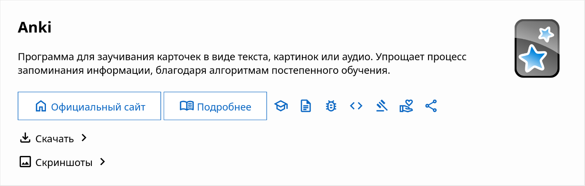

Что делает Kool Tech Tricks уникальным ресурсом, и что нужно иметь в виду при
редактировании и написании страниц.

<!--more-->

## Почему Kool Tech Tricks, а не *какой-либо другой ресурс*?

Многие сайты существуют в основном с целью заработка на показе рекламы. В них
авторы часто не проверяют программы, а копируют содержимое из каких-то
источников. Спустя время страницы не обновляются и быстро устаревают.

Есть списки рекомендаций, обычно на GitHub под названием Awesome *что-то*. Это
просто списки программного обеспечения со ссылками на официальный сайт и
кратким описанием. Пользователи могут просматривать эти списки и находить для
себя что-то полезное, но дальше придётся самому изучать функциональность
программ.

Сайт Kool Tech Tricks не содержит рекламы и существует исключительно с целью
продвижения хорошего ПО, обучения пользованию, помощи в исправлении проблем.
Поэтому всё содержимое тщательно проверяется редакторами (которыми может стать
любой желающий) и регулярно обновляется. Тексты должны быть понятны всем, вне
зависимости навыков использования компьютера. Списки программного обеспечения
содержат необходимую и достаточную информацию, чтобы читатели могли сделать
свои выводы. В дополнение к ним могут идти отдельные страницы про конкретное ПО
о том, как это использовать и что нужно знать.

## Программное обеспечение

Всё программное обеспечение (ПО), которое рекомендуется на сайте, должно
соответствовать критериям качества. Это необходимо, чтобы читатели пользовались
действительно хорошим ПО, разработчики которых уважают своих пользователей.

### Критерии качества

1. **Поддерживается разработчиками.** ПО можно рекомендовать только в том
случае, когда его разработчики продолжают выпускать исправления ошибок и
безопасности. Если вы видите, что ПО не получало обновлений длительное время
(когда ему нужны регулярные обновления) или репозиторий заархивирован, то его
следует избегать.

2. **Относительно безопасно.** ПО не должно выполнять сомнительной активности:
неоправданные подключения к сторонним серверам, сбор и обработка лишних данных
без ведома пользователя.

3. **Дружелюбно к пользователю и не содержит много багов.** Любой пользователь,
который пользуется рекомендуемым ПО, не должен раздражаться от сложного
интерфейса, вылетов, тормозов и багов. То, что предназначено для продвинутых
пользователей, должно быть обозначено соответствующим образом.

4. **Представляет минимальный интерес.** Существует огромное множество
программного обеспечения, которое может выполнять идентичные функции или
являться модификациями других. Во избежание перегруженности страницы для
читателей и редакторов, стоит задаться вопросом: а в чём смысл использовать Y,
если уже есть X, который выполняет идентичные функции? Если есть весомые
аргументы использовать Y вместо X, то его можно тоже включить в подборку.

### Карточки

Это небольшие вставки на страницах [подборок](#подборки) и раздела
[программы](#программы), которые содержат название, значок и краткое описание, а
также дополнительные ссылки, скачивание/установка и скриншоты.

Краткое описание должно хорошо описывать суть ПО. Его возможно скопировать,
нажав на кнопку «Поделиться», вместе со ссылками на официальный сайт и на
страницу с подробной информацией.

Ссылки на получение (скачивание/установку) должны вести на все основные
источники, откуда читатель сможет начать пользоваться этой программой. После
перехода по ссылке должно быть произведено минимальное число действий для
дальнейшего использования. Порядок ссылок зависит от того, насколько лучше или
проще получить ПО.

Скриншоты должны содержать экраны, показывающие основную функциональность и
внешний вид. У читателя должно сложиться ясное представление, как эта программа
может выглядеть на своём устройстве. Настройки должны быть установлены по
умолчанию: светлая/тёмная тема, язык страницы русский.

### Когда можно внести свой вклад?

- Отсутствует ПО, которое подходит по всем критериям и может рекомендоваться к
использованию.

- Некорректные или устаревшие данные (ссылки, название, скриншоты, набор
функций, предупреждения).

- Вышли обновления или новости, которые требуют внимания читателей (прекращение
поддержки, новая функциональность, изменения в политике).

- ПО нужно убрать по причине негативных изменений, исключающих из него
вышеупомянутые критерии качества, или появления лучшей альтернативы.

## Разделы

Принадлежность страницы к определённому разделу зависит от цели её содержания.
Иногда содержимое можно разделить на несколько страниц, которые будут
принадлежать разным разделам.

### Программы

[Программное обеспечение](https://kooltechtricks.org/software) (ПО) — это
большой список рекомендаций, содержащий отдельные страницы с подробной
информацией.

ПО часто содержит множество нюансов, которые следует знать всем пользователям.
Страницы ПО как раз должны все эти моменты описывать.

Следует писать страницы о ПО, которое действительно нуждается в подробной
информации или продвижении.

### Подборки

[Подборки](https://kooltechtricks.org/collections) — это страницы, на которых
собрано различное программное обеспечение по одной теме.

Подборки должны помогать читателям выбирать себе программы, приложения или
сервисы. Это достигается за счёт [карточек](#карточки) и небольших рассказов о
функциональности.

Подборки не содержат всё возможное программное обеспечение, а только то, что
попадает под [критерии качества](#критерии-качества). Порядок в целом не особо
важен, но то, что лучше подходит под критерии, может находиться выше.

### Таблицы

[Таблицы сравнения](https://kooltechtricks.org/tables) предназначены для более
продвинутых читателей, которые готовы сами изучать все тонкости ПО, и делать
выводы на основе этого. Здесь не применяются строгие
[критерии качества](#критерии-качества), поэтому может быть включено больше
программ. Однако всё же следует соблюдать критерий минимального интереса.

### Руководства

[Руководства](https://kooltechtricks.org/guides) должны иметь определённую цель:
научиться пользоваться чем-то или достичь чего-либо. Не стоит уходить от темы:
если это нужно сделать, то оставьте ссылки на другие руководства.

### Вики

[Вики](https://kooltechtricks.org/wiki) не содержит рекомендаций, а только
информацию для понимания тех или иных вещей. Эти страницы могут помочь дать
идею, почему в других разделах одно ПО предпочтительнее другого.
