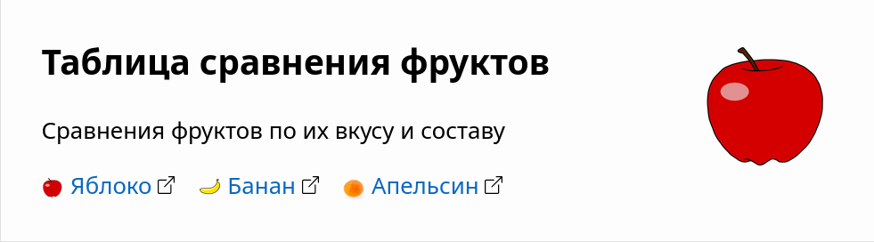
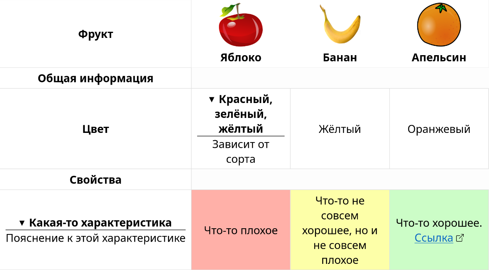

Таблицы сравнения позволяют читателям легко сравнивать приложения и сервисы по
характеристикам.

## Текстовый формат

Таблицы сравнения хранятся в формате HTML.

## Пример

Данные: `/data/links/tables/fruits.yaml`

```yaml
unit: Фрукт
icon: apple.png
features:
  - id: apple
  - title: Банан
    icon: banana.png
    homepage: https://ru.wikipedia.org/wiki/Банан
  - id: orange
seeAlso:
  - title: Подборка фруктов
    link: /collections/fruits
    description: >
      Отобранные фрукты, которые наиболее сочные и полезные.
```

Содержимое: `/content/tables/fruits.html`

```html
---
title: Таблица сравнения фруктов
publishDate: 2025-01-06T15:50:00Z
lastmod: 2026-02-15T19:18:00Z
contributors: [kttrickster, 'John Doe']
summary: >
  Сравнения фруктов по их вкусу и составу
---
<tr>
    <th>Общая информация</th>
</tr>
<tr>
    <th>Цвет</th>
    <!--Яблоко-->  <td><details><summary>Красный, зелёный, жёлтый</summary>Зависит от сорта</details></td>
    <!--Банан-->   <td>Жёлтый</td>
    <!--Апельсин--><td>Оранжевый</td>
</tr>
<tr>
    <th>Свойства</th>
</tr>
<tr>
    <th>
        <details>
            <summary>Какая-то характеристика</summary>
            Тут можно добавить пояснение, которое спрятано в раскрывающемся меню.
        </details>
    </th>
    <!--Яблоко-->  <td class="bad">Что-то плохое</td>
    <!--Банан-->   <td class="warn">Что-то не совсем хорошее, но и не совсем плохое</td>
    <!--Апельсин--><td class="good">Что-то хорошее. <a href="https://example.com" target="_blank">Ссылка</a></td>
</tr>
```





## Лицевая сторона (Front matter)

Отделяется `---` в начале и в конце.

|Ключ|Значение|
|:--:|:------:|
|`title`|Заголовок страницы. Должен начинаться с "Таблица сравнения".
|`publishDate`|Дата и время публикации. Самое первое появление страницы на сайте. Не меняется.
|`lastmod`|Дата и время последнего обновления содержимого страницы. Меняется перед созданием коммита, который вносит изменения в содержимое страницы для читателя.
|`contributors`|Список людей, работавших над этой страницей. По желанию можно добавить свой ник, если вносите свой вклад.
|`summary`|Краткое описание таблицы. Отображается в предпросмотре ссылки.

## Таблица

Идёт после `---` лицевой стороны. Пожалуйста, соблюдайте отступы в 4 пробела.

### Строки

Каждая строка задаётся внутри `<tr> </tr>`:

```html
<tr>
    ...
</tr>
<tr>
    ...
</tr>
```

### Ячейка

#### Заголовок

Первая ячейка строки всегда закреплена слева — это название характеристики
сравнения. Задаётся внутри `<th> </th>`:

```html
<tr>
    <th>Заголовок</th>
    ...
</tr>
```

Если это раздел, то нужно оставить здесь только одну ячейку.

Если нужно добавить пояснение к заголовку:

```html
<tr>
    <th>
        <details>
            <summary>Кратко</summary>
            Подробное пояснение, которое раскрывается при нажатии
        </details>
    </th> 
    ...
</tr>
```

#### Остальные ячейки

```html
<tr>
    <th>Заголовок</th>
    <!--Первый столбец-->         <td>Содержимое</td>
    <!--Столбец под номером два--><td>Что-то</td>
</tr>
```

Внутри `<!-- -->` пишется название столбца. Не отображается на итоговой
странице, используется лишь для удобства редакторов. Пробелы справа нужны для
выравнивания.

Внутри `<td> </td>` пишется содержимое ячейки.

Цвета должны соответствовать по смыслу:
- `<td class="bad">`: Красный цвет.
- `<td class="warn">`: Жёлтый цвет.
- `<td class="good">`: Зелёный цвет.

Вы можете оставить ссылку внутри ячейки:
`<a href="https://example.com" target="_blank">Ссылка</a>`

Вы можете оставить пояснение к ячейке:

```html
<details><summary>Кратко</summary>Подробное пояснение, которое раскрывается при нажатии<details>
```

## Дополнительные ссылки и информация

Скопируйте `/data/links/tables/_TEMPLATE.yaml` в ту же директорию и назовите
так же, как и файл таблицы (в примере `fruits.yaml`). Отредактируйте файл
согласно шаблону.
